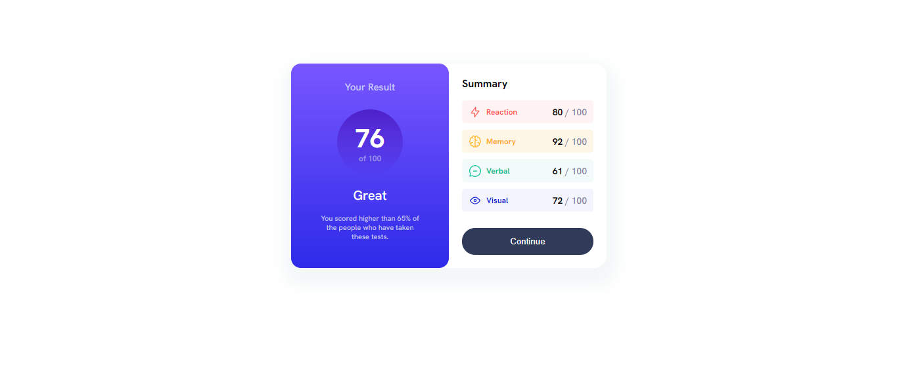
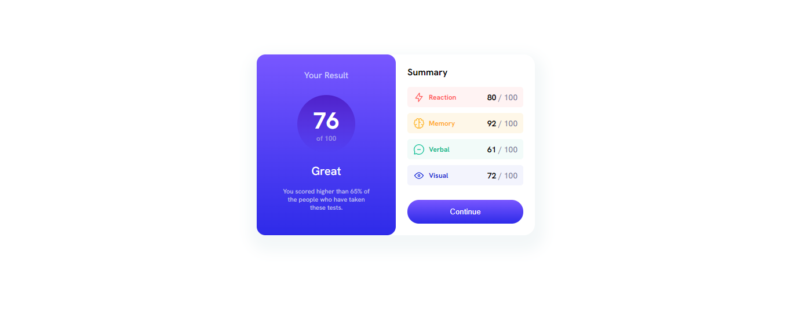
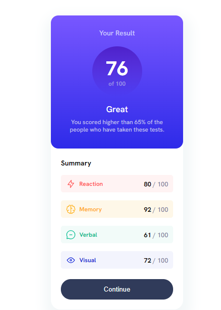

# result-summary-component-FrontendMentor

# Frontend Mentor - Results summary component solution

This is a solution to the [Results summary component challenge on Frontend Mentor](https://www.frontendmentor.io/challenges/results-summary-component-CE_K6s0maV). Frontend Mentor challenges help you improve your coding skills by building realistic projects. 

## Table of contents

- [Frontend Mentor - Results summary component solution](#frontend-mentor---results-summary-component-solution)
  - [Table of contents](#table-of-contents)
  - [Overview](#overview)
    - [The challenge](#the-challenge)
    - [Screenshot](#screenshot)
    - [Links](#links)
  - [My process](#my-process)
    - [Built with](#built-with)
    - [What I learned](#what-i-learned)
    - [Continued development](#continued-development)
    - [Useful resources](#useful-resources)
  - [Author](#author)

## Overview

### The challenge

Users should be able to:

- View the optimal layout for the interface depending on their device's screen size
- See hover and focus states for all interactive elements on the page
- **Bonus**: Use the local JSON data to dynamically populate the content

### Screenshot

### Links

- Solution URL: [(https://github.com/Similoluwa10/result-summary-component-FrontendMentor)](https://github.com/Similoluwa10/result-summary-component-FrontendMentor)
- 
- Live Site URL: [(https://similoluwa10.github.io/result-summary-component-FrontendMentor/)](https://similoluwa10.github.io/result-summary-component-FrontendMentor/)

## My process

### Built with

- Semantic HTML5 markup
- CSS custom properties
- Flexbox
- CSS Grid
- @ media queries

### What I learned

- I learned how to make use of @media queries 
- Also how to align image with text by making use of the align-items property of the flexbox

### Continued development

Use this section to outline areas that you want to continue focusing on in future projects. These could be concepts you're still not completely comfortable with or techniques you found useful that you want to refine and perfect.

### Useful resources

- [https://www.w3schools.com/](https://www.w3schools.com/) - I highly recommend W3 schools for anyone who is trying to get better at web development. It serves as a guide and a reference for anytime you get stuck on a challenge.

## Author

- Gbenle Similoluwa

